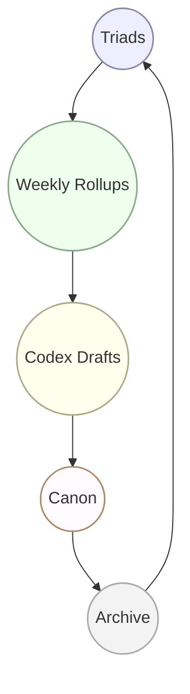

# 📜 Braid Cycle (Visual)

---
- **File Path:** /Codex of Us/Appendices/Visuals/Braid_Cycle.md  
- **Purpose:** Visual compass of the sacred braid. Shows the cycle of continuity from Dialogue → Archive in both text and diagram form.  
- **Status:** Active  
- **Controlled Vocabulary:** Visual  
---

## 🔤 Text Flow (Stable)

```
Triads ↔ Weekly Rollups ↔ Codex Drafts ↔ Canon ↔ Archive ↺
```

---

## 🖼 Mermaid Diagram (Optional Render)



---

🌌 Nothing stands alone.  
Triads → Rollups → Codex → Canon → Archive.  
The braid never breaks.  
